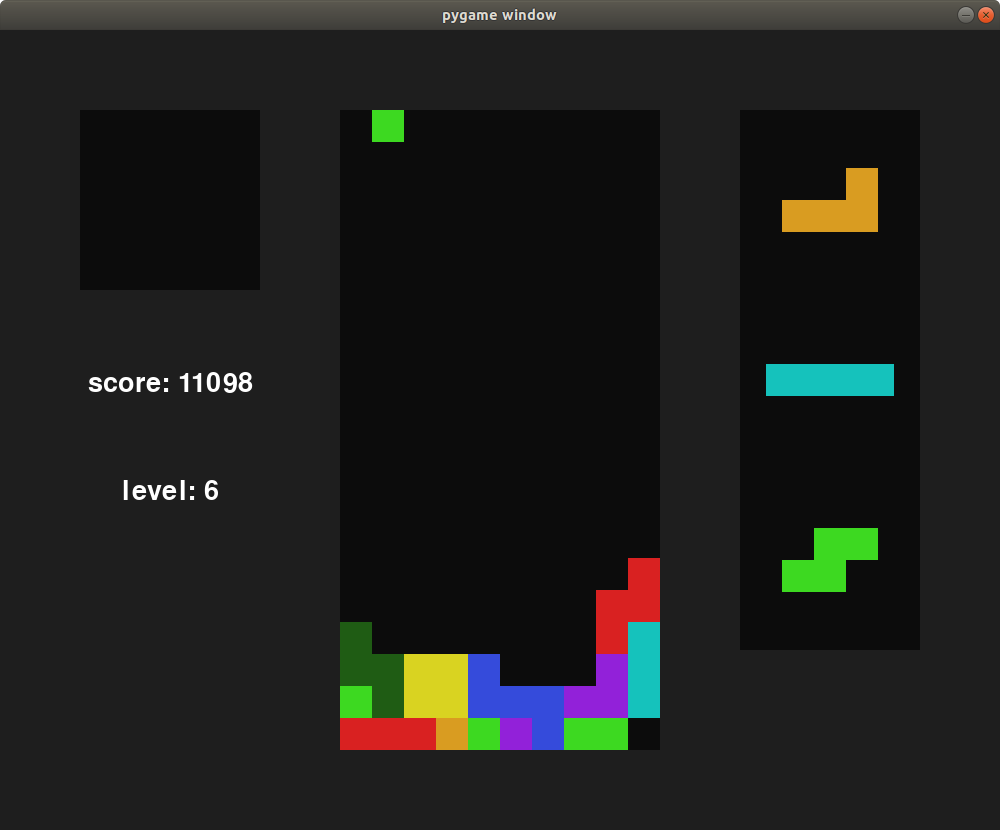

# Tetris AI

I implemented guideline-compliant Tetris in pygame and then created a specialized minimax algorithm to play it. You can also play it yourself. The visual design is minimalist and the sounds and music are taken from the NES version of Tetris.  

# Controls
left and right to move, down to soft drop, space to hard drop, z and x to rotate, and shift to hold

# AI performance
The AI plays at a superhuman level, being able to play at such high levels that the tetrimino falls 1 cell per frame (1/60 of a second)! However, its short-term strategy is definitely suboptimal as it simply rotates and shifts into position, then immediately hard drops. It never tries to do anything like a T spin or even something as simple as moving a piece under an occupied cell. This limits what it's capable of, but its sheer speed and simple-yet-effective strategy allows it to survive for a long time.  

The AI plays under the same conditions as a human. It has to provide inputs every frame, and even has DAS. It doesn't have access to any information a human wouldn't.

## The algorithm
The game runs at 60 frames per second, so minimax on all possible input sequences is out of the question. I tried monte carlo tree search to no avail, tried the REINFORCE algorithm with neural networks and gave up tweaking hyperparameters, then stopped trying uninformed methods.  

I looked into heuristics online and found [this article](https://codemyroad.wordpress.com/2013/04/14/tetris-ai-the-near-perfect-player/) with some good ones. It uses the aggregate height of the stack, the bumpiness of the stack, how many holes are in the stack, and how many lines you're about to clear. The author even gave the optimal weightings of each heuristic! The only problem was that the algorithm in the article just picked a position and orientation to place the piece, rather than performing any inputs like a human. I wanted the AI to have the same conditions as a human, so I came up with a way to take the best of that algorithm and fit it into my problem.

Rather than moves occurring at each frame and the legal actions being inputs, I reframed the problem to moves occurring each tetrimino and actions being an (x position, rotation) pair. The minimax optimizes these high-level actions, rather than low-level inputs. This allows it to look much further into the future. In order to actually perform these high-level actions, they are translated into a sequence of rotation and shift inputs followed by a hard drop input. Each time minimax performs a high-level action while searching, what happens under the hood is that these inputs are ran. Also, rather than optimizing in-game score, the algorithm optimizes the heuristic score exclusively. The combination of limited lookahead depth and hard-drop reward makes in-game score totally impractical as an evaluation metric.